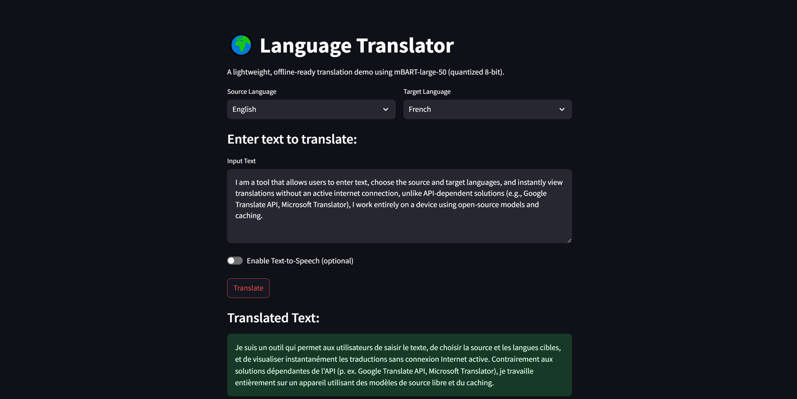
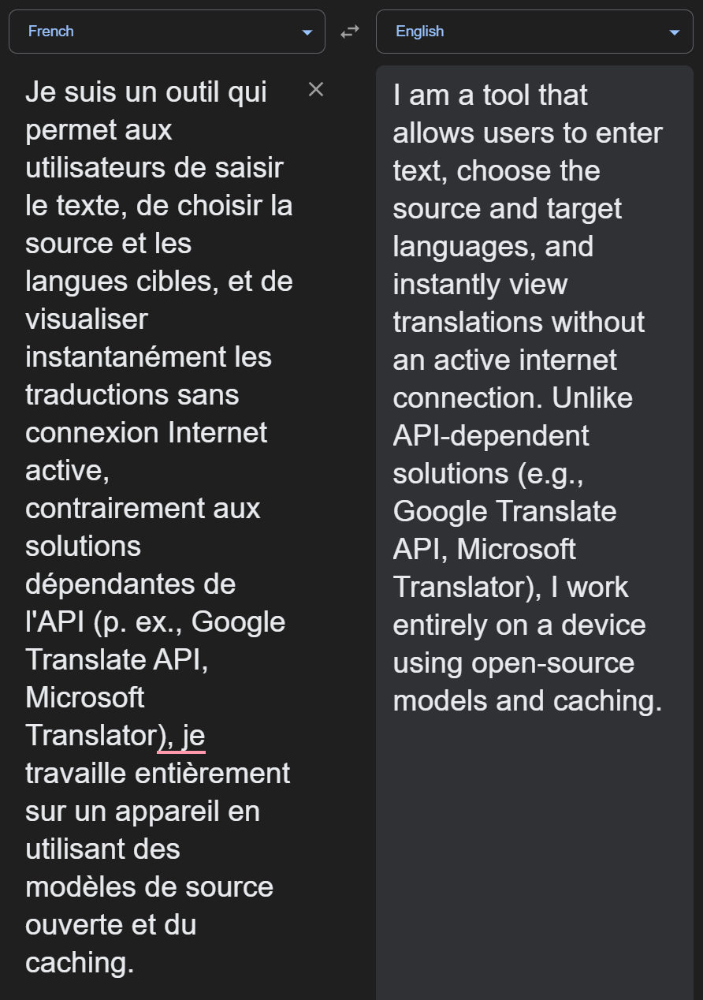

# Language Translation Tool

A compact, research-minded language translation project implemented in Python. This tool allows users to input text, choose source and target languages, and instantly view translations — all **without an active internet connection**.  
Unlike API-dependent solutions (e.g., Google Translate API, Microsoft Translator), this project operates entirely on-device using open-source models and caching.

> NOTE: This repository is intended for learning, research experiments, and prototyping. It is not production-ready — see the Limitations section.

---

## Table of contents
- About
- Quick demo (screenshot)
- Key features
- Limitations
- Tech stack & model details
- System requirements
- Architecture & workflow
- Repository layout
- Installation
- Usage
- Caching strategy
- UI components
- Future work
- Contributing

---

## About
Language Translation Tool (LTT) is a developer-focused project that demonstrates how to run an offline, quantized multilingual translation model locally with a small web UI. The goal is reproducible experiments with compact deployments — no commercial APIs required.

---

## Quick demo — screenshot




---

## Key features
- Language translation using an mBART-based model (quantized for CPU efficiency).
- Streamlit web UI for simple interaction.
- Tokenization utilities and preprocessing (`utils/tokenizer_utils.py`).
- Lightweight caching layer using SQLite to store previously translated texts.
- Simple app entrypoint (`app.py`) for local runs.

---

## Limitations
- Limited languages: The current implementation targets a small set of major languages (see `config/settings.py` / `setup.md`). Many language pairs are not supported or lack high-quality translations.
- Model constraints: The repository is wired for CPU-friendly, quantized models. Expect slower performance and higher memory usage compared to production GPU deployments.
- No production features: There is no authentication, rate-limiting, input sanitization, or hardened API surface.
- No formal evaluation: The project contains no automated evaluation suite or benchmarking harness by default — add tests/evaluations before trusting outputs.

`If you require a production-grade system, consider managed translation services or invest in model evaluation, monitoring, and secure deployment.`

---

## Tech stack & model details
- Language: Python (recommended 3.10+)
- Model: `facebook/mbart-large-50-many-to-many-mmt` (quantized, 8-bit recommended for CPU)
- Libraries (see `requirements.txt`): `transformers`, `torch`, `streamlit`, `SQLAlchemy`, `sentencepiece`, `pyttsx3` (optional TTS)
- Tokenizer: SentencePiece (multilingual)
- Approx. model parameters: ~610M (quantized footprint depends on backend; expect a few GB of RAM before aggressive optimizations)

Refer to `setup.md` for recommended model and quantization notes.

---

## Workflow
High-level flow:
1. User submits text via the Streamlit UI.
2. Text is preprocessed and tokenized via `utils/tokenizer_utils.py`.
3. The cache (`cache/db_handler.py`) is checked for an existing translation.
4. If missing, the quantized mBART model in `model/translator.py` performs translation.
5. Result is displayed and optionally persisted to the cache.

---

## Repository layout
```

Language_Translator/
│
├── app.py                     # Main Streamlit script
├── model/
│   ├── **init**.py
│   ├── translator.py          # Handles model loading & translation logic
│
├── cache/
│   ├── **init**.py
│   ├── db_handler.py          # SQLAlchemy ORM + cache management
│
├── config/
│   ├── **init**.py
│   ├── settings.py            # Constants, language list, model configs
│
├── utils/
│   ├── **init**.py
│   ├── tokenizer_utils.py     # Text cleaning & truncation
│   ├── ui_helpers.py          # Streamlit layout & UI components
│
├── assets/
│   ├── screenshots.png
│
└── requirements.txt           # Project dependencies

````
---

## Installation

Recommended Python 3.10+ in a virtual environment.

1. Create a virtual environment:

```powershell
python -m venv .venv
```

2. Activate (Windows cmd):

```cmd
.venv\Scripts\activate.bat
```

(Or PowerShell: `.venv\Scripts\Activate.ps1`)

3. Install dependencies:

```cmd
pip install -r requirements.txt
```

4. If you plan to run the Streamlit UI, install extras if necessary and ensure `streamlit` is available.

Refer to `setup.md` for model quantization steps and large-model considerations.

---

## Usage
Run locally with Python or Streamlit.

- Start with a direct Python run (if `app.py` supports a CLI mode):

```cmd
python app.py
```

- Or run with Streamlit (if `app.py` is a Streamlit app):

```cmd
streamlit run app.py
```

Notes:
- The first run may download the model; expect a longer cold-start time.
- Use `failing_cases.txt` to collect poor translations for iterative improvement.

---

## Caching strategy
- Backend: SQLite (via SQLAlchemy in `cache/db_handler.py`).
- Stored fields: `(source_lang, target_lang, input_text, translated_text, timestamp)`.
- Purge policy: configurable (e.g., purge entries older than `CACHE_EXPIRY_DAYS`).
- Benefit: reduces repeated model inference for identical inputs.

---

## UI components
- Header: logo & title
- Language selector: source & target language dropdowns
- Input field: text area with length recommendation
- Translate button: executes translation/caching flow
- Result panel: translated text and optional TTS control
- Footer: attribution and small status/help text

---

## Future work 
- Broaden language coverage and add auto-detection.
- Add automated evaluation (BLEU/ChrF) and unit/integration tests.
- Provide Docker + Compose for reproducible deployments.
- Add CI/CD workflows and pre-commit hooks.
- Support model quantized formats and low-RAM inference (ONNX, quantization-aware). 
- Add authentication and API mode for secure multi-user usage.
- Implement batch translation and export to CSV/JSON.

---

## Contributing
Contributions are welcome. Suggested workflow:
1. Fork the repository and create a feature branch.
2. Run tests and linters locally (once added).
3. Open a PR with a clear description and linking to an issue if applicable.

For larger changes (new models, datasets, or APIs), open an issue first to discuss the approach.

